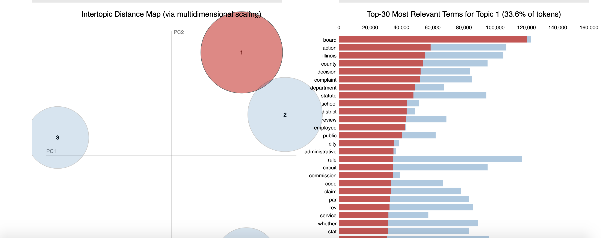

# law_docs

# The Data 

This repository explores legal cases made available by The Caselaw Access Project ('CAP'). CAP expands public access the legal cases in the United States; digitized from the Harvard Law Library collections. The collection includes all official book-published case law. For the purpose of this repository, I decided to focus on Illinois, to create a model that could then be used on other states. 

# Legal Citations and Graph Theory 

I was able to use regex to extract citations information. The cases that each case rely upon were placed in a column: 'citations'. These would then be used for graph theory in the notebook 'citation_graphs', to create a directed graph, linking legal cases. *Still in progress*

# Corpus Specific Words (Legalese)

In addition to the common stopwords in nltk's corpus, I needed to also highlight legal-corpus-specific words that could be added to the stopwords. To accomplish this I used a CountVectorizer with max_features to find the most common words. This list included common words, such as: 'wa', 'court', 'defendant', 'ill', 'plaintiff', '2d', '3d', 'case', 'trial', 'evidence', 'state', 'would', 'upon', 'judgment', etc. Adding these words to stop_words allows the models to focus on the most distinguishing words.

# Summarization & Keywords 

I then used summarization and keywords to get the keywords of each case and the create a summary of each case. Initially I thought that these could be useful for clustering cases; but this was not as successful as the others models. However, I still used the keywords and summaries of each case in the output of the other models.

# Doc2Vec 

I then used Doc2Vec on the cleaned text corpus and was able to find vectors for each legal case that could then be used to find similar documents. For example, a user could write a sentence of the main facts of the case (a factum) and then use the Doc2Vec model to infer a vector for this query, and then find the most similar document vectors. 
 

# LDA Topic Modeling

Next, using LDA, I was able to cluster the documents into 5 different groups based on latent topics. 

I then used LDA on these 5 separate groups to then find subtopics within them. The following sub-topics were shown:

Topic 1: Family Law

* Sub-Topic 1: complaint, department, school, district, employee, administrative, statute
* Sub-Topic 2: petition, child, marriage, property, support
* Sub-Topic 3: child, parent, custody, mental, care, minor
* Sub-Topic 4: sentence, conviction, guilty, plea, probation, record

Topic 2: Labor Law?

* Sub-Topic 5: complaint, damage, claim, agreement
* Sub-Topic 6: insurance, insurer, company, coverage, liability, claim
* Sub-Topic 7: city, ordinance, commission, building, lease, zoning

Topic 3: Corporate and Commercial Law

* Sub-Topic 8: estate, deed, property, trust, mortgage, land
* Sub-Topic 9: company, bank, stock, corporation, contact, business
* Sub-Topic 10: error, filed, bill, record, petition
* Sub-Topic 11: tax, contract, property, count, land, board, assessment

Topic 4: Criminal Cases (Felonies)

* Sub-Topic 12: testimony, testified, witness, police, jury, victim
* Sub-Topic 13: jury, sentence, guilty, murder, criminal, record
* Sub-Topic 14: officer, police, car, search, arrest, found, vehicle, warrant, possession

Topic 5: Civil Cases (contracts and torts)

* Sub-Topic 15: car, negligence, injury, accident
* Sub-Topic 16: claimant, injury, doctor, accident, employee, work, industrial, medical, compensation, hospital, claim
* Sub-Topic 17: street, city, property, company, damage, building, company, owner, foot, road, land

# MVP 

The current 'Minimal Viable Product' has a few functions. It can take in keywords, a sentence, or sentences and use the Doc2Vec model to find similar documents. 
It can also limit those similar cases to those which fall under the same LDA topic and then can also limit to those cases that occurred after a given date. 

The next model (work in progress) will include the sub-topics found in the LDA modeling, as well as, the graph theory based on citations.

